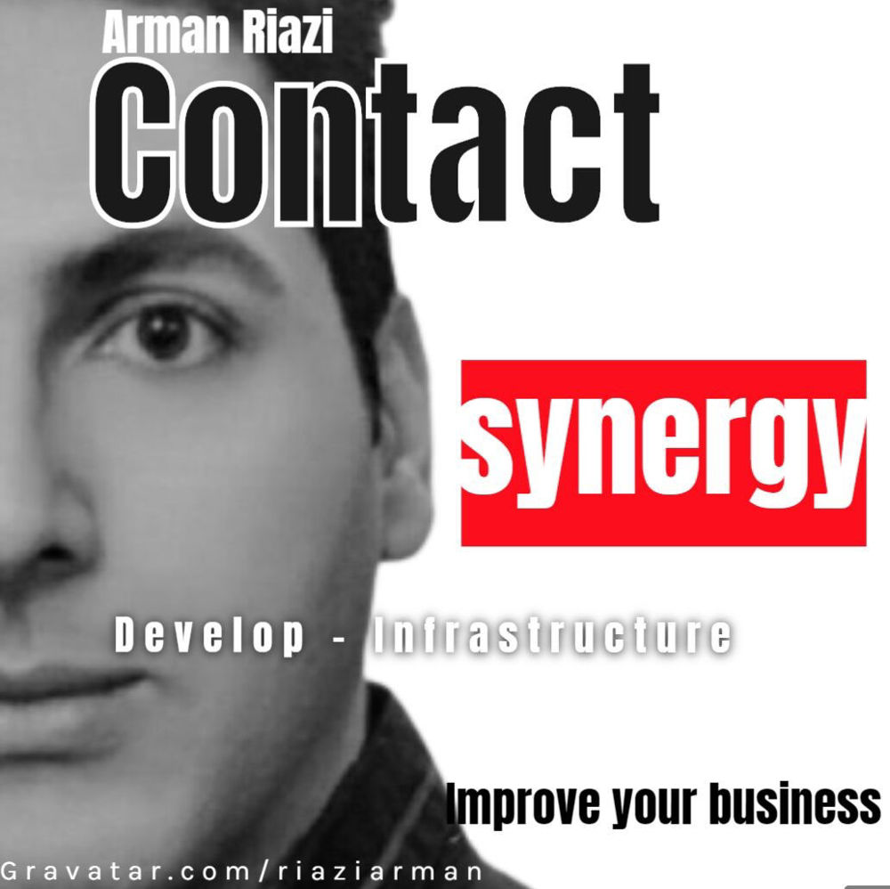

# About Me
> Arman Riazi knows how to move your business, mind, developing on blockchain 4.0.

> Getting Luxary services that you can afford.

<!--<iframe src="https://drive.google.com/file/d/1g8he91nt_O4yo2feBwK2fD--sB3T-rVn/preview" width="720" height="420" allow="autoplay" loading="lazy" allowfullscreen="false"  style="border:1px solid black;" marginheight="0px" marginwidth="0px" scrolling="false" allow-downloads="false"></iframe>-->



> I have been working on the Blockchain ecosystem as a CryptoTrader and Blockchain developer for about 2 years.

> Following the table is my recent experience and my favorite 😋 for access to [archive](public/archive/archive-until-2016.md) before 2020 you can click on it.

``` Exprt: Experience ```
``` Prd: Period ```
``` Desc: Description ```
``` Priority: My Interest priority for keep in continue ```

| Exprt | Prd  |  Priority | Desc
|:----------:|:-------------:|:---------------:|:---------------|
| CryptoTrading | 1 Y  |  :material-check:      |  [Experience losts liquid because of trading crypto in 2021 🤕](public/mynotes/exp-2021cryprotrading.md)  |
|    Solidity  | 2 M         |    :material-check-all:   | It seems to me that there would be better languages for developing so in the near furure we need to low-level lang for improve performance hardware resources |
| IBM HyperLedger       |      1 M        |        :material-check-all:          |  HyperLedger is suited for organizations especially. Hyperledger has got good community and uses cloud-native tools but I think it is not a real decentralized blockchain framework for scalability and giving governance so I used to decide a little bit work on it           |
| Rust-Lang      | 4 M       |  :material-check-all::material-check:        |      Fantastic, complex language for decentralized/distributed     |
| Substrate     |  2 M           |       :material-check-all::material-check:          |        Awsome work of 🙏Dr.gavin and parity.io community        |
| Polkadot & Kusuma        |      1 M     |        :material-check-all::material-check:          |       Crowdloan, tokenization💲, parachain and parathreads         |
| Blockchain research       |      6 M        |        :material-check-all::material-check:          |        It is always included in my routine activity during a day        |

About 8-month trading, 2 months solidity, 4 months rust-lang, 2 months substrate, 2 months research on Polkadot ecosystem, 6 month scholar research on blockchain. There is not exactly the time to estimate spend time since developing and learning would go with each other. In my opinion, developers who had a kind of skills like Frontend, Backend, or Database have been forced into the Blockchain ecosystem because of the charm of the subject and the rapid growth and evolution of the Technology. I wonder to let you know I am big on **Substrate and WASM**[[Substrate]][[WASM]] to apply for mixing experiences and technologies that lead to **Defi2.0 & Web3.0**.
 
 > Hands-On Experience With Blockchain Developing.

 > Knowledge Of Blockchain Structure.

 > Experienced With Software Development Lifecycle. 

 > Experienced With **Cloud-Computing** And #DevOps #CloudNative Tools. 

 > Expert In **Modern** Programming Languages.

 > Have Technical Conscience To Define The Right Blockchain Solutions. 

 > Understand Decentralized Ledgers and Configure Full/Master#Node. 

 > Technical Knowledge of Standards and Ecosystems. 

 > Cryptocurrency #trading and using financial services. 

 > Graduated **M.Sc**[[MasterThesis]] In Field Of Information Technology. 
 
 Over 10 years of experience in designing, developing, deploying, analyzing, and implementing [[Cloud]]-native, web, and software engineers. 
 
 Expertise in the architecture of #Microservices and distributed systems, and modifying related application code. Capable of learning new programming languages and technologies. 

 * Good communication, problem-solving, documentation, and analytical. 
 * Capable of learning new skills and concepts quickly. 
 * Maintain effective relationships with others. 
 * General features including Research, Creative, Analyze, Developing. 
 * Highly organized, motivated, confident.
 * I have a passport and I finished military service.
 