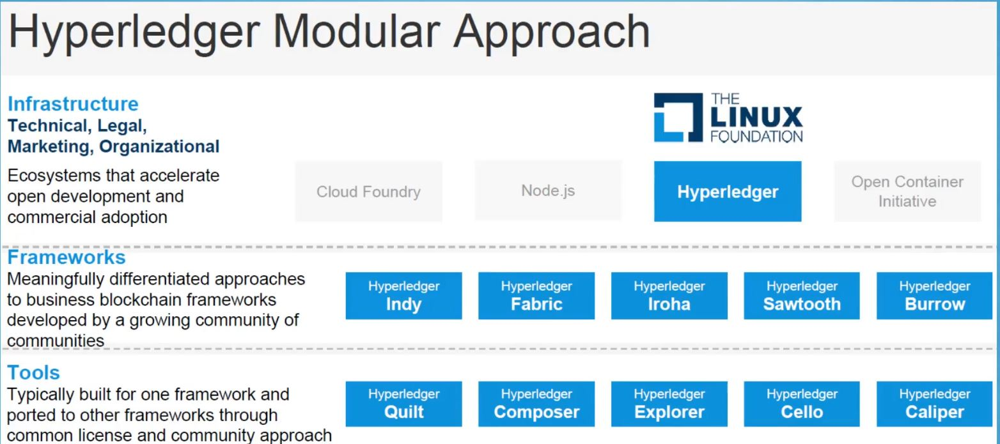
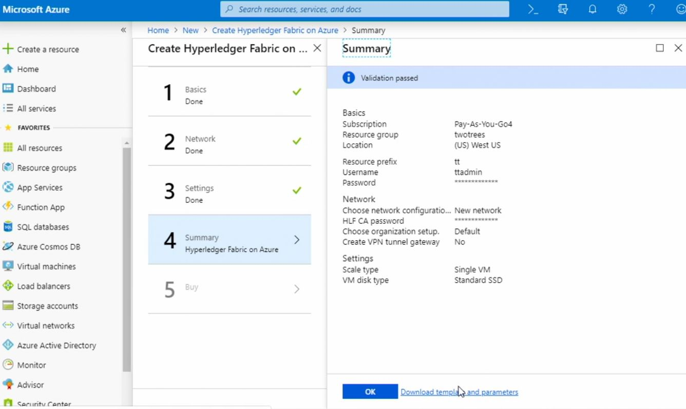

# HyperLedger-IBM

??? quote
    I remember, used hyperledger-fabric with composer, kubernetes, and even Node-Red.The framework is suit for specialist who have experience with [[Devops]] and I can say that Composer is good idea for this developing.

Using standards defined: flexibility, scalability, availability of service under any circumstances, the above mentioned through another branch of technology called DevOps that is compatible with web applications and blockchain, the ability to implement and strengthen the blockchain The author of this project has been working on it.

Due to the learning of [[Blockchain]], we are faced with several technologies. The use of #HyperLedger, which is provided under the supervision of Linux and is also used by #IBM, and the second case is the use of Ethereum, the second version of which is scheduled to be released by the end of 2021 based on the POS consensus algorithm.

The figure above shows the fact that large companies today rely on open source tools for their infrastructure components, and what you see is all free, but the company has been able to establish an effective communication platform base on the cloud.

In short, we are not dealing with occasional challenges, but rather "wheels will not move unless the engine works right."

# Hyperledger-Golang

## Features

> #Golang

> On-permise

> Define Blockchain as manual and changeable

> Scratch Structure

> Deploy on [docker]("https://arman-riazi-science.medium.com/ufw-allow-http-ufw-allow-https-curl-fssl-https-download-docker-com-linux-ubuntu-gpg-1d9c611ed56b")

> Scale-up by Kubernetes

> No need for pay-as-you-go services

> Complex implementation
 

# Hyperledger-Azure

## Features

> Blockchain as a service

> Scale-up with Kubernetes

> [Docker](https://arman-riazi-science.medium.com/ufw-allow-http-ufw-allow-https-curl-fssl-https-download-docker-com-linux-ubuntu-gpg-1d9c611ed56b)-Compose

> Wrote by Hyperledger-Compose

> Pay-as-you-go

> Secured by Microsoft

